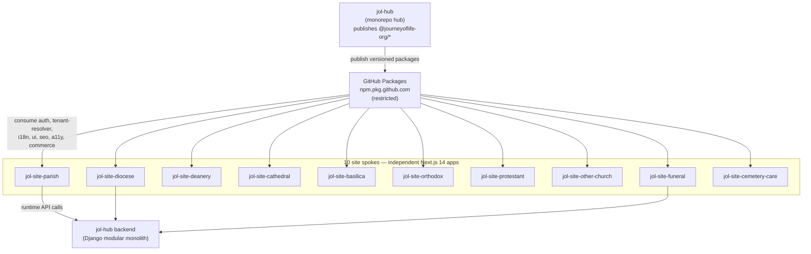

# ADR-011: Hub-and-Spoke Monorepo Federation

## Document Control

| Field            | Value                              |
|------------------|------------------------------------|
| Document ID      | ADR-011                            |
| Title            | Hub-and-Spoke Monorepo Federation  |
| Version          | 1.0.0                              |
| Classification   | Public                             |
| Owner (role)     | Platform Architect                 |
| Approver (role)  | JOL Governance Board               |
| Effective Date   | 2026-09-25                         |
| Next Review      | 2027-09-25                         |
| Review Cycle     | Annual, or upon material change    |

## Status

Accepted

> **This is the ADR referenced by the ten `jol-site-*` spoke repositories** (topic `adr-011`,
> description "Next.js 14 spoke consuming `@jol-hub/*` packages (ADR-011)"). Before this record was
> written, the decision existed only implicitly in code and repository descriptions. This document
> is now the authoritative source.

## Context

The platform must deliver on the order of **400,000 tenant websites** across **27 EU countries**,
spanning distinct verticals — parish, diocese, deanery, cathedral, basilica, orthodox, protestant,
other-church, funeral, and cemetery-care. Each vertical has its own presentation, content model,
SEO profile, and locale, but all share the same underlying capabilities: authentication, tenant
resolution, internationalisation, design system, commerce, SEO, accessibility, observability, and
CRM integration.

Two extremes were rejected:

- **One giant monorepo for everything** — a single repository containing all ten verticals would
  couple their release cycles, make per-vertical ownership and CI scoping impossible, and create a
  blast radius where any vertical can break all others.
- **Ten fully independent codebases** — duplicating auth, tenant resolution, i18n, the design
  system, and SEO logic across ten repos guarantees drift, multiplies the security-patching
  surface, and makes consistent GDPR/tenancy behaviour impossible to guarantee.

The platform needs **shared, versioned capabilities** with **independently releasable verticals**.

## Decision

We will adopt a **hub-and-spoke federation**:

- **The hub** is the `jol-hub` monorepo. It is the authoritative source of shared platform logic and
  publishes versioned internal packages under the `@journeyoflife-org/*` npm scope to **GitHub
  Packages** (`npm.pkg.github.com`, restricted access). The published packages include:
  `auth`, `tenant-resolver`, `i18n`, `ui`, `seo`, `a11y`, `commerce`, `bitrix-sdk`,
  `observability`, `perf`, `seed-data`, and `testing`.
- **The spokes** are the ten `jol-site-*` repositories
  (`basilica`, `cathedral`, `cemetery-care`, `deanery`, `diocese`, `funeral`, `orthodox`,
  `other-church`, `parish`, `protestant`). Each is an **independent Next.js 14 application** that
  **consumes `@journeyoflife-org/*` packages** rather than re-implementing shared capability.
- Spokes depend on the hub **only through published, versioned packages** — never through relative
  paths, git submodules, or shared source trees. This keeps the contract explicit and reviewable.
- Shared behaviour that must be uniform across all tenants — **authentication, tenant resolution,
  and tenant isolation** ([ADR-007](ADR-007-multi-tenant-rls-isolation.md)) — lives **only** in the
  hub packages, so a fix ships to every spoke by a version bump.
- Each spoke owns its own release cycle, CI, and vertical-specific content/presentation, while
  inheriting the platform baseline from the hub.
- The hub also hosts reference front-end apps (`master-site`, `parish-template`,
  `template-renderer`, `admin-dashboard`) that spokes and the renderer are built from.

## Consequences

### Positive

- **Write once, ship everywhere**: a security or tenancy fix in a hub package reaches all ten
  spokes with a version bump, eliminating drift in the highest-risk code.
- **Independent release cycles**: each vertical ships on its own cadence without blocking others.
- **Explicit, versioned contract**: spokes depend on published package versions, so changes are
  reviewable, testable, and rollback-able.
- **Clear ownership**: hub packages and each spoke have distinct CODEOWNERS and CI scope.
- **Consistent compliance**: uniform auth, tenant resolution, and isolation across all verticals
  supports GDPR and SOC 2 evidence.

### Negative

- **Versioning discipline is mandatory**: breaking changes to a hub package must follow semver and
  a migration path, or ten spokes break.
- **Publishing pipeline required**: the hub needs a reliable build/publish flow to GitHub Packages
  and spokes need authenticated install (`NODE_AUTH_TOKEN`).
- **Upgrade coordination**: spokes can lag on package versions, so the platform must track and
  remediate stale dependencies (Dependabot).
- **Latency between fix and rollout**: a hub fix is not live in a spoke until that spoke upgrades.

### Neutral / follow-ups

- Requires a package-versioning and deprecation policy (semver, LTS window for breaking changes).
- Dependabot on each spoke keeps hub packages current (configured via `jol-control`).
- The renderer/template path (`template-renderer`, `parish-template`) is how 400K tenant sites are
  generated from spoke + hub building blocks.

## Evidence

- Spoke repositories (10) carry topic `adr-011` and description "Next.js 14 spoke consuming
  `@jol-hub/*` packages (ADR-011)" — e.g. `jol-control/repos/jol-site-parish.yml`.
- Hub packages published under `@journeyoflife-org/*` to GitHub Packages, restricted access:
  `jol-hub/frontend/packages/*/package.json` (`publishConfig.registry =
  https://npm.pkg.github.com`, `access = restricted`), e.g. `tenant-resolver`, `ui`, `auth`,
  `i18n`, `seo`, `a11y`, `commerce`, `bitrix-sdk`, `observability`, `perf`, `seed-data`, `testing`.
- Workspace linking via `workspace:*` (pnpm) inside the hub:
  `jol-hub/frontend/packages/tenant-resolver/package.json` depends on
  `@journeyoflife-org/seed-data: workspace:*`; peer dependency `next >= 14`.
- Hub reference apps: `jol-hub/frontend/apps/{master-site,parish-template,template-renderer,admin-dashboard}`.
- Hub mission: `jol-hub` description "JOL-HUB Enterprise Monorepo: 400K websites, 200 sub-projects,
  27 EU countries."

## Change History

| Version | Date | Author (role) | Change |
|---------|------|---------------|--------|
| 1.0.0 | 2026-09-25 | Platform Architect | Recorded retroactively from implemented architecture; made authoritative for the `adr-011` references in the ten site spokes. Status Accepted. |
