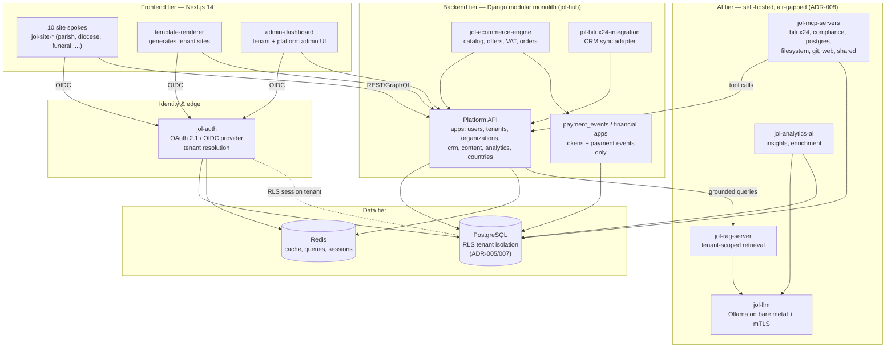

# Container Diagram (C4 Level 2)

## Document Control

| Field            | Value                              |
|------------------|------------------------------------|
| Document ID      | ARC-L2-001                         |
| Title            | Container Diagram (C4 Level 2)     |
| Version          | 1.0.0                              |
| Classification   | Public                             |
| Owner (role)     | Platform Architect                 |
| Approver (role)  | JOL Governance Board               |
| Effective Date   | 2026-09-25                         |
| Next Review      | 2027-09-25                         |
| Review Cycle     | Annual, or upon material change    |

## Purpose

This is the **C4 Level 2 (Container)** view: the deployable applications, datastores, and services
inside the JOL platform boundary, and how they communicate. A "container" here means a separately
deployable unit (an app, an API, a datastore), not necessarily a Docker container.

For the people and external systems around the platform, see
[`system-landscape.md`](system-landscape.md).

## Container Diagram

## Containers

| Container | Repository | Technology | Responsibility |
|-----------|-----------|------------|----------------|
| **Site spokes** (×10) | `jol-site-*` | Next.js 14 | Public tenant websites per vertical; consume `@journeyoflife-org/*` ([ADR-011](../adr/ADR-011-hub-and-spoke-monorepo-federation.md)). |
| **template-renderer** | `jol-hub` (frontend app) | Next.js | Renders the ~400K tenant sites from spoke + hub building blocks. |
| **admin-dashboard** | `jol-hub` (frontend app) | Next.js | Tenant and platform administration UI. |
| **jol-auth** | `jol-auth` | OAuth 2.1 / OIDC | Identity provider, token signing/JWKS, tenant resolution and boundary. |
| **Platform API** | `jol-hub` (backend) | Django (Python 3.12) | Modular monolith: users, tenants, organizations, crm, content, analytics, countries ([ADR-006](../adr/ADR-006-django-modular-monolith.md)). |
| **jol-ecommerce-engine** | `jol-ecommerce-engine` | Django/API | Catalog, service offerings, VAT, order lifecycle ([ADR-010](../adr/ADR-010-ecommerce-pci-saq-a.md)). |
| **payment_events / financial** | `jol-hub` (apps) | Django | Store payment tokens/events and financial records — never card data. |
| **jol-bitrix24-integration** | `jol-bitrix24-integration` | Adapter | Sync contacts, organizations, leads, orders with Bitrix24 CRM. |
| **jol-llm** | `jol-llm` | Ollama | Self-hosted, air-gapped inference with mTLS ([ADR-008](../adr/ADR-008-self-hosted-llm-air-gapped.md)). |
| **jol-rag-server** | `jol-rag-server` | Retrieval service | Tenant-scoped retrieval grounding AI responses. |
| **jol-mcp-servers** | `jol-mcp-servers` | MCP | Tool-augmented AI access to CRM, DB, filesystem, web ([ADR-009](../adr/ADR-009-mcp-tool-integration.md)). |
| **jol-analytics-ai** | `jol-analytics-ai` | Python | Insights, reporting, enrichment, recommendations. |
| **PostgreSQL** | (infra) | PostgreSQL | Primary system of record with RLS tenant isolation ([ADR-005](../adr/ADR-005-postgresql-primary-datastore.md), [ADR-007](../adr/ADR-007-multi-tenant-rls-isolation.md)). |
| **Redis** | (infra) | Redis | Cache, queues, ephemeral session state — not a system of record. |

## Key Interactions

1. **Authentication** — frontends obtain tokens from `jol-auth` (OIDC); the tenant is resolved at the
   edge and propagated as `X-Tenant-ID`.
2. **Data access** — the API opens a database session, sets the session tenant, and PostgreSQL RLS
   restricts every query to that tenant ([ADR-007](../adr/ADR-007-multi-tenant-rls-isolation.md)).
3. **Payments** — checkout uses provider hosted fields; JOL stores only tokens/events
   ([ADR-010](../adr/ADR-010-ecommerce-pci-saq-a.md)).
4. **AI** — the API/RAG send tenant-scoped, minimised prompts to the air-gapped LLM; MCP servers
   expose tools under the same tenancy and authorisation.

## Compliance Anchors

| Framework | Relevance |
|-----------|-----------|
| GDPR Art. 30 | Each container that processes personal data is a processing activity in the RoPA. |
| GDPR Art. 32 | Encryption in transit (mTLS for AI, TLS for API) and at rest (PostgreSQL). |
| SOC 2 CC6 | Least-privilege container boundaries; identity at the edge. |
| PCI-DSS | CDE limited to `payment_events`/`financial` + provider; see `jol-payments-scope`. |

## Change History

| Version | Date | Author (role) | Change |
|---------|------|---------------|--------|
| 1.0.0 | 2026-09-25 | Platform Architect | Initial C4 Level-2 container view. |
