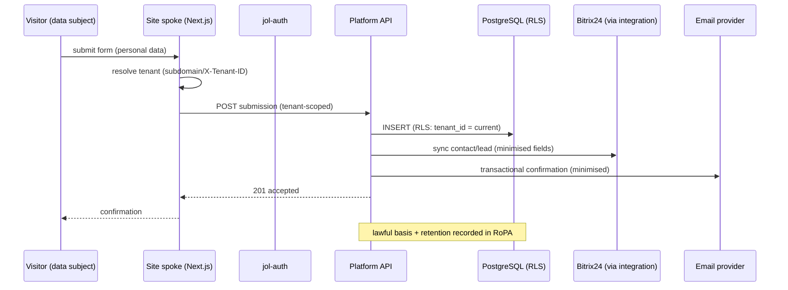
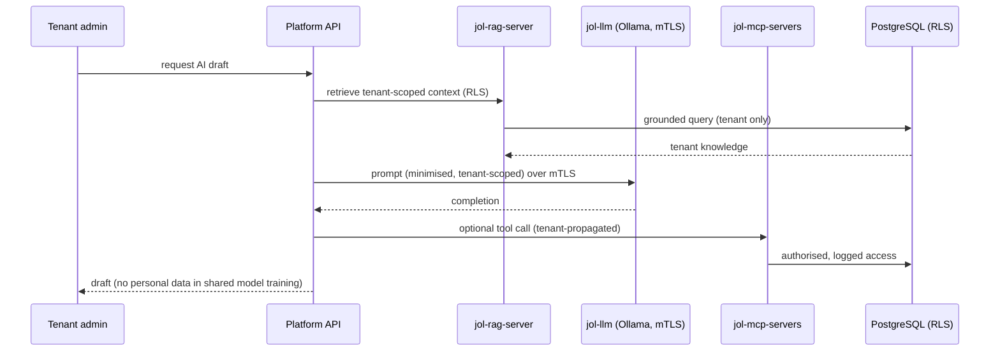
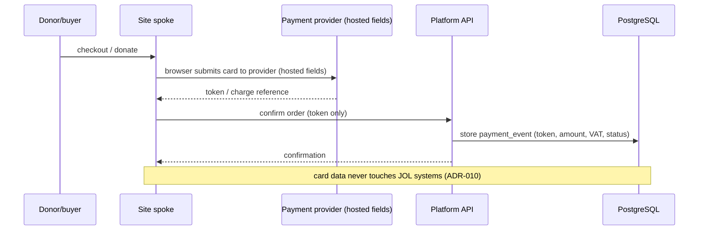
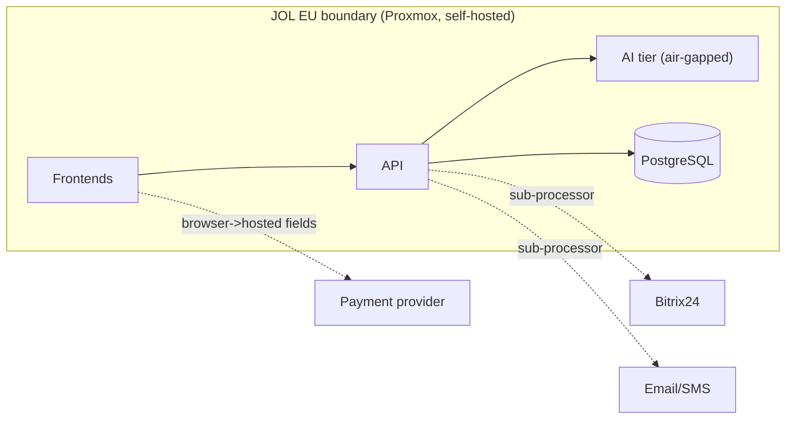

# End-to-End Data Flow

## Document Control

| Field            | Value                              |
|------------------|------------------------------------|
| Document ID      | ARC-DF-001                         |
| Title            | End-to-End Data Flow               |
| Version          | 1.0.0                              |
| Classification   | Public                             |
| Owner (role)     | Platform Architect / Data Protection Officer |
| Approver (role)  | JOL Governance Board               |
| Effective Date   | 2026-09-25                         |
| Next Review      | 2027-09-25                         |
| Review Cycle     | Annual, or upon material change    |

## Purpose

This view traces how data moves through the platform for the principal processing activities. It is
the architectural counterpart to the GDPR data-flow maps in
[`../gdpr/data-flow-maps.md`](../gdpr/data-flow-maps.md); together they satisfy GDPR Art. 30 and
support DPIAs.

## Flow 1 — Public Visitor Submits a Form (e.g. funeral notice, contact)



| Step | Data | GDPR note |
|------|------|-----------|
| Form submit | Name, email, message, (optional) special-category | Lawful basis recorded per activity ([`../gdpr/lawful-basis-register.md`](../gdpr/lawful-basis-register.md)) |
| DB insert | Stored tenant-scoped | RLS isolation ([`multi-tenancy.md`](multi-tenancy.md)) |
| CRM sync | Minimised contact fields | Bitrix24 is a sub-processor ([`../gdpr/ropa-processor.md`](../gdpr/ropa-processor.md)) |
| Email | Minimised content | Email provider is a sub-processor |

## Flow 2 — Tenant Administrator Manages Content

```mermaid
sequenceDiagram
  participant TA as Tenant admin
  participant AD as admin-dashboard
  participant A as jol-auth
  participant API as Platform API
  participant DB as PostgreSQL (RLS)

  TA->>AD: sign in
  AD->>A: OIDC authentication
  A-->>AD: id_token (+ tenant claim, role)
  TA->>AD: edit/publish content
  AD->>API: request + Authorization + X-Tenant-ID
  API->>API: verify tenant membership + role (RBAC)
  API->>DB: SET app.current_tenant; write (RLS)
  DB-->>API: ok
  API-->>AD: 200
```

## Flow 3 — AI-Assisted Content Generation (air-gapped)



> Prompts/completions containing personal data are treated as personal data: minimised, logged
> sparingly, retained per schedule, and **never** used to train shared models
> ([ADR-008](../adr/ADR-008-self-hosted-llm-air-gapped.md)).

## Flow 4 — Payment / Donation (PCI SAQ A)



## Data Stores & Personal Data

| Store | Personal data? | Isolation | Retention |
|-------|----------------|-----------|-----------|
| PostgreSQL | Yes (users, contacts, submissions, orders) | RLS per tenant | [`../gdpr/retention-schedule.md`](../gdpr/retention-schedule.md) |
| Redis | Ephemeral (sessions, cache) | TTL + tenant-scoped keys | Short-lived; not a system of record |
| Object storage (media) | Possibly (avatars, uploads) | Tenant-scoped paths | Per retention schedule |
| Logs / telemetry | Minimised; no special-category | Tenant tag where applicable | Per retention schedule |

## Trust Boundaries



Cross-boundary flows to sub-processors are recorded in
[`../gdpr/ropa-processor.md`](../gdpr/ropa-processor.md) and
[`../gdpr/international-transfers.md`](../gdpr/international-transfers.md).

## Compliance Anchors

| Framework | Relevance |
|-----------|-----------|
| GDPR Art. 30 | Each flow is a processing activity in the RoPA |
| GDPR Art. 35 | Flows inform DPIAs (held in `jol-privacy`) |
| SOC 2 CC6 | Data flow crosses defined trust boundaries with access control |
| PCI-DSS | Card data excluded from JOL systems ([ADR-010](../adr/ADR-010-ecommerce-pci-saq-a.md)) |

## Change History

| Version | Date | Author (role) | Change |
|---------|------|---------------|--------|
| 1.0.0 | 2026-09-25 | Platform Architect | Initial end-to-end data-flow view. |
