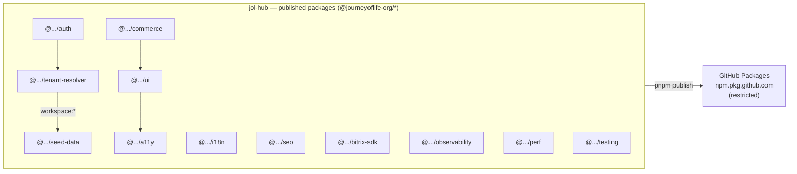
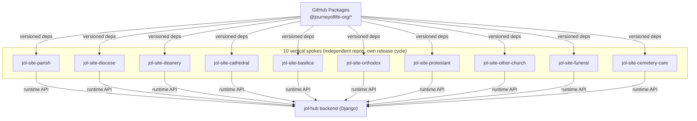

# Hub-and-Spoke Federation (ADR-011 in Detail)

## Document Control

| Field            | Value                              |
|------------------|------------------------------------|
| Document ID      | ARC-HS-001                         |
| Title            | Hub-and-Spoke Federation           |
| Version          | 1.0.0                              |
| Classification   | Public                             |
| Owner (role)     | Platform Architect                 |
| Approver (role)  | JOL Governance Board               |
| Effective Date   | 2026-09-25                         |
| Next Review      | 2027-09-25                         |
| Review Cycle     | Annual, or upon material change    |

## Purpose

This view expands [ADR-011](../adr/ADR-011-hub-and-spoke-monorepo-federation.md): how the `jol-hub`
monorepo publishes shared capability and how the ten `jol-site-*` verticals consume it. It is the
authoritative picture of the platform's front-end topology.

## The Hub

`jol-hub` is the authoritative source of shared platform logic. Its `frontend/packages/*` are
published as versioned npm packages under the `@journeyoflife-org/*` scope to **GitHub Packages**
(restricted access).

| Package | Capability | Why it must be shared |
|---------|-----------|-----------------------|
| `@journeyoflife-org/auth` | OIDC client, token handling | Uniform authentication across all verticals |
| `@journeyoflife-org/tenant-resolver` | `X-Tenant-ID` / subdomain resolution | Tenant isolation must behave identically everywhere ([ADR-007](../adr/ADR-007-multi-tenant-rls-isolation.md)) |
| `@journeyoflife-org/i18n` | Localisation (27 EU countries) | Consistent locale/hreflang behaviour |
| `@journeyoflife-org/ui` | Design system / components | One accessible, on-brand component library |
| `@journeyoflife-org/seo` | Meta / Schema.org generation | Uniform SEO and structured data |
| `@journeyoflife-org/a11y` | Accessibility helpers | WCAG conformance across all sites |
| `@journeyoflife-org/commerce` | Catalog/checkout UI primitives | Consistent, PCI-safe commerce UX ([ADR-010](../adr/ADR-010-ecommerce-pci-saq-a.md)) |
| `@journeyoflife-org/bitrix-sdk` | Bitrix24 CRM client | One audited CRM integration |
| `@journeyoflife-org/observability` | Logging/tracing hooks | Uniform telemetry and audit |
| `@journeyoflife-org/perf` | Performance budgets | Consistent Core Web Vitals targets |
| `@journeyoflife-org/seed-data` | Fixtures/seed | Reproducible dev/test data |
| `@journeyoflife-org/testing` | Test utilities | Uniform test harness |

## The Spokes

Each spoke is an **independent Next.js 14 application** in its own repository. Spokes consume hub
packages by version — never by relative path, submodule, or shared source.

## Contract Rules

1. **Versioned dependency only.** A spoke declares hub packages in `package.json` with a version
   range; the lockfile pins the exact version.
2. **Semver discipline.** Breaking changes to a hub package require a major version bump and a
   documented migration; spokes upgrade deliberately.
3. **No cross-spoke imports.** Spokes never depend on each other; shared code goes into the hub.
4. **Shared security/tenancy lives in the hub.** `auth` and `tenant-resolver` are the single source
   of truth; a fix ships to all spokes on upgrade.
5. **Authenticated install.** Spokes install from GitHub Packages using a scoped `NODE_AUTH_TOKEN`
   with least privilege (read:packages).

## Upgrade & Drift Control

- **Dependabot** on each spoke opens PRs for hub package updates (configured via `jol-control`).
- A **version matrix** (spoke → hub package versions) is reviewed periodically; stale spokes on
  deprecated majors are tracked as compliance debt.
- The hub may declare an **LTS window** for a major version so spokes have time to migrate.

## Failure Modes & Mitigations

| Failure mode | Mitigation |
|--------------|------------|
| Breaking hub change breaks 10 spokes | Semver + migration guide + staged rollout; spokes pin versions |
| Spoke lags on a package with a security fix | Dependabot + version-matrix review + patch SLA |
| Publishing pipeline down | Spokes keep last-pinned versions; publish is build-time, not runtime |
| Token leak in CI | Scoped, short-lived `NODE_AUTH_TOKEN`; secret scanning ([ADR-011](../adr/ADR-011-hub-and-spoke-monorepo-federation.md)) |

## Compliance Anchors

| Framework | Relevance |
|-----------|-----------|
| SOC 2 CC7/CC8 | Versioned, reviewed dependency changes; uniform telemetry |
| ISO 27001 A.8.25/A.8.28 | Secure development lifecycle and secure coding across spokes |
| GDPR Art. 25 | Data-protection-by-design: shared `auth`/`tenant-resolver` enforce isolation uniformly |

## Change History

| Version | Date | Author (role) | Change |
|---------|------|---------------|--------|
| 1.0.0 | 2026-09-25 | Platform Architect | Initial hub-and-spoke federation view (expands ADR-011). |
