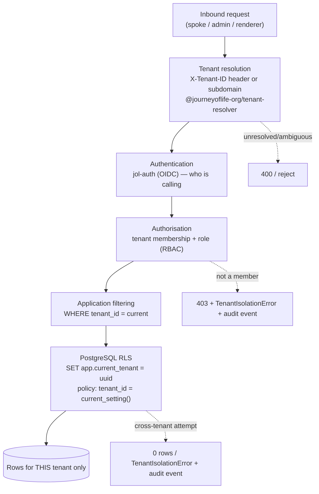
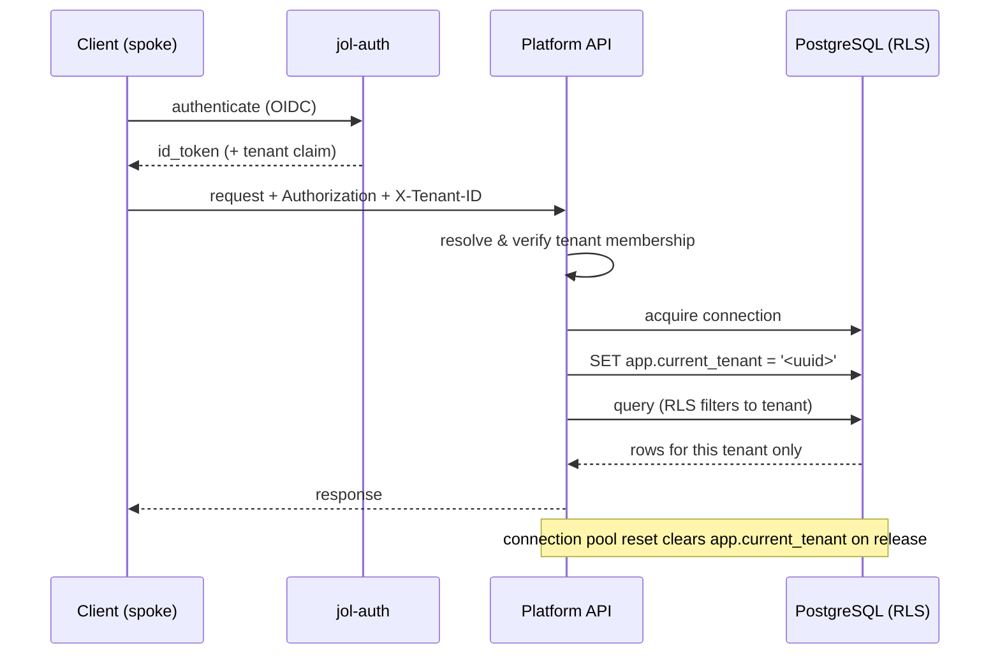

# Multi-Tenancy & Tenant Isolation

## Document Control

| Field            | Value                              |
|------------------|------------------------------------|
| Document ID      | ARC-MT-001                         |
| Title            | Multi-Tenancy & Tenant Isolation   |
| Version          | 1.0.0                              |
| Classification   | Public                             |
| Owner (role)     | Platform Architect / Data Protection Officer |
| Approver (role)  | JOL Governance Board               |
| Effective Date   | 2026-09-25                         |
| Next Review      | 2027-09-25                         |
| Review Cycle     | Annual, or upon material change    |

## Purpose

This view describes how the platform isolates ~400,000 tenants from one another, from request
ingress to database row. It implements [ADR-007](../adr/ADR-007-multi-tenant-rls-isolation.md) and
aligns with `jol-auth` service-local ADR-002 (tenant boundary).

## Tenant Model

- Each tenant (a religious institution) is identified by a **UUID `tenant_id`**.
- Every tenant-scoped table carries a `tenant_id` column with a foreign-key constraint.
- A single shared PostgreSQL instance holds all tenants; isolation is enforced by **Row-Level
  Security (RLS)**, not by separate databases ([ADR-005](../adr/ADR-005-postgresql-primary-datastore.md)).

## Isolation Layers (defence in depth)

| Layer | Control | Failure behaviour |
|-------|---------|-------------------|
| **1. Resolution** | Tenant resolved once at the edge from `X-Tenant-ID` or subdomain. | Unresolved/ambiguous → reject (400). |
| **2. Authentication** | `jol-auth` verifies the caller (OIDC). | Invalid token → 401. |
| **3. Authorisation** | Caller must be a member of the tenant with an adequate role. | Non-member → 403 + `TenantIsolationError` + audit event. |
| **4. Application filter** | Repository queries filter by `tenant_id`. | Missing filter is a bug — caught by tests, not relied upon. |
| **5. Database RLS** | Session tenant set; RLS policy restricts rows. | Cross-tenant access returns no rows / raises error + audit event. |

**Layers 4 and 5 are independent.** Even if an application filter is forgotten (layer 4), RLS
(layer 5) still prevents cross-tenant reads/writes. This is the core of
[ADR-007](../adr/ADR-007-multi-tenant-rls-isolation.md).

## Session Tenant Propagation

> **Critical invariant:** the session tenant **must** be set on every connection acquisition and
> **cleared on release** (pool reset hook). A pooled connection that retains a previous tenant is a
> cross-tenant leak. This is covered by automated tests.

## Tenant-Scoped Data

Tenant-scoped tables include (non-exhaustive): organizations, users/memberships, content, CRM
contacts/leads, orders/payment events, donations, analytics events, and per-country configuration
overrides. Platform-global reference data (e.g. canonical taxonomy) is read-only and not
tenant-scoped.

## Testing Requirements

- **Repository level** — RLS denies cross-tenant reads/writes.
- **Service level** — services cannot bypass tenancy.
- **API level** — a token for tenant A cannot read/write tenant B.
- **Pool level** — connection reuse never leaks a prior tenant.

A new tenant-scoped table **without** an RLS policy and test fails code review.

## Compliance Anchors

| Framework | Relevance |
|-----------|-----------|
| GDPR Art. 5(1)(f), Art. 32 | Integrity & confidentiality; security of processing |
| GDPR Art. 33 | Cross-tenant leak would be a reportable breach — isolation prevents it |
| SOC 2 CC6.1 | Logical access controls; least privilege per tenant |
| ISO 27001 A.8.3 | Information-access restriction |

## Change History

| Version | Date | Author (role) | Change |
|---------|------|---------------|--------|
| 1.0.0 | 2026-09-25 | Platform Architect | Initial multi-tenancy and isolation view. |
