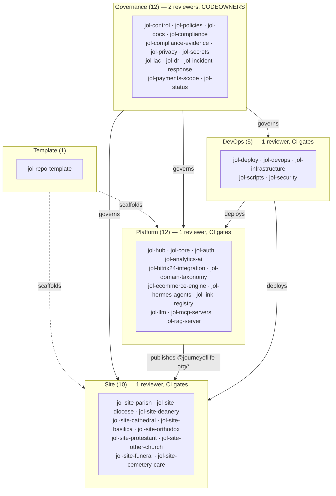

# Repository Map (40 Repositories, 5 Tiers)

## Document Control

| Field            | Value                              |
|------------------|------------------------------------|
| Document ID      | ARC-RM-001                         |
| Title            | Repository Map                     |
| Version          | 1.0.0                              |
| Classification   | Public                             |
| Owner (role)     | Platform Architect                 |
| Approver (role)  | JOL Governance Board               |
| Effective Date   | 2026-09-25                         |
| Next Review      | 2027-09-25                         |
| Review Cycle     | Annual, or upon material change    |

## Purpose

The `journeyoflife-org` GitHub organisation contains **40 repositories**, governed declaratively by
[`jol-control`](https://github.com/journeyoflife-org/jol-control). This map shows how they group
into tiers and how they relate. The allow-list of record is `jol-control/repos/*.yml`; this document
is the human-readable view.

## Tier Overview

## Governance Tier (12)

| Repository | Purpose |
|------------|---------|
| [`jol-control`](https://github.com/journeyoflife-org/jol-control) | Central governance control plane — Terraform IaC, policy baselines, compliance gates |
| [`jol-policies`](https://github.com/journeyoflife-org/jol-policies) | ISMS policy suite (SOC 2 / ISO 27001 / GDPR) |
| [`jol-docs`](https://github.com/journeyoflife-org/jol-docs) | This hub — ADRs, architecture, GDPR records |
| [`jol-compliance`](https://github.com/journeyoflife-org/jol-compliance) | Compliance program management and monitoring |
| [`jol-compliance-evidence`](https://github.com/journeyoflife-org/jol-compliance-evidence) | Audit evidence, control mappings, findings |
| [`jol-privacy`](https://github.com/journeyoflife-org/jol-privacy) | DPIAs, data mapping, lawful-basis records, DSR handling |
| [`jol-secrets`](https://github.com/journeyoflife-org/jol-secrets) | Secrets management design, rotation, key management |
| [`jol-iac`](https://github.com/journeyoflife-org/jol-iac) | IaC templates and shared modules |
| [`jol-dr`](https://github.com/journeyoflife-org/jol-dr) | Disaster recovery, RTO/RPO, backup, continuity |
| [`jol-incident-response`](https://github.com/journeyoflife-org/jol-incident-response) | IR runbooks, escalation, post-incident review |
| [`jol-payments-scope`](https://github.com/journeyoflife-org/jol-payments-scope) | PCI-DSS scope, CDE boundaries, card data-flow |
| [`jol-status`](https://github.com/journeyoflife-org/jol-status) | Public status page and incident communication |

## Platform Tier (12)

| Repository | Purpose |
|------------|---------|
| [`jol-hub`](https://github.com/journeyoflife-org/jol-hub) | Integration monorepo — the hub ([ADR-011](../adr/ADR-011-hub-and-spoke-monorepo-federation.md)) |
| [`jol-core`](https://github.com/journeyoflife-org/jol-core) | Core server and AI orchestration engine |
| [`jol-auth`](https://github.com/journeyoflife-org/jol-auth) | OAuth 2.1 / OIDC, multi-tenant RBAC (service-local ADR-001…004) |
| [`jol-analytics-ai`](https://github.com/journeyoflife-org/jol-analytics-ai) | Analytics and AI enrichment services |
| [`jol-bitrix24-integration`](https://github.com/journeyoflife-org/jol-bitrix24-integration) | Bitrix24 CRM integration layer |
| [`jol-domain-taxonomy`](https://github.com/journeyoflife-org/jol-domain-taxonomy) | Canonical taxonomy and classification rules |
| [`jol-ecommerce-engine`](https://github.com/journeyoflife-org/jol-ecommerce-engine) | Catalog, offerings, payments, VAT ([ADR-010](../adr/ADR-010-ecommerce-pci-saq-a.md)) |
| [`jol-hermes-agents`](https://github.com/journeyoflife-org/jol-hermes-agents) | Hermes multi-agent orchestration framework |
| [`jol-link-registry`](https://github.com/journeyoflife-org/jol-link-registry) | Centralised registry of JOL web links and codes |
| [`jol-llm`](https://github.com/journeyoflife-org/jol-llm) | Self-hosted, air-gapped LLM platform ([ADR-008](../adr/ADR-008-self-hosted-llm-air-gapped.md)) |
| [`jol-mcp-servers`](https://github.com/journeyoflife-org/jol-mcp-servers) | MCP servers for tool-augmented AI ([ADR-009](../adr/ADR-009-mcp-tool-integration.md)) |
| [`jol-rag-server`](https://github.com/journeyoflife-org/jol-rag-server) | Retrieval-Augmented Generation server |

## DevOps Tier (5)

| Repository | Purpose |
|------------|---------|
| [`jol-deploy`](https://github.com/journeyoflife-org/jol-deploy) | Deployment automation scripts and procedures |
| [`jol-devops`](https://github.com/journeyoflife-org/jol-devops) | Reusable CI/CD workflows, runbooks, observability |
| [`jol-infrastructure`](https://github.com/journeyoflife-org/jol-infrastructure) | IaC, containerisation, environment configs (Proxmox) |
| [`jol-scripts`](https://github.com/journeyoflife-org/jol-scripts) | Shared utility scripts and automation |
| [`jol-security`](https://github.com/journeyoflife-org/jol-security) | Vulnerability scanning, security policies, enforcement |

## Site Tier (10) — the ADR-011 spokes

| Repository | Vertical |
|------------|----------|
| [`jol-site-parish`](https://github.com/journeyoflife-org/jol-site-parish) | Parish |
| [`jol-site-diocese`](https://github.com/journeyoflife-org/jol-site-diocese) | Diocese |
| [`jol-site-deanery`](https://github.com/journeyoflife-org/jol-site-deanery) | Deanery |
| [`jol-site-cathedral`](https://github.com/journeyoflife-org/jol-site-cathedral) | Cathedral |
| [`jol-site-basilica`](https://github.com/journeyoflife-org/jol-site-basilica) | Basilica |
| [`jol-site-orthodox`](https://github.com/journeyoflife-org/jol-site-orthodox) | Orthodox |
| [`jol-site-protestant`](https://github.com/journeyoflife-org/jol-site-protestant) | Protestant |
| [`jol-site-other-church`](https://github.com/journeyoflife-org/jol-site-other-church) | Other church |
| [`jol-site-funeral`](https://github.com/journeyoflife-org/jol-site-funeral) | Funeral |
| [`jol-site-cemetery-care`](https://github.com/journeyoflife-org/jol-site-cemetery-care) | Cemetery care |

All ten are independent Next.js 14 apps consuming `@journeyoflife-org/*` packages
([ADR-011](../adr/ADR-011-hub-and-spoke-monorepo-federation.md), [`hub-and-spoke.md`](hub-and-spoke.md)).

## Template Tier (1)

| Repository | Purpose |
|------------|---------|
| [`jol-repo-template`](https://github.com/journeyoflife-org/jol-repo-template) | Enterprise repository template scaffolding new repos |

## Governance Model

| Tier | Repos | Reviewers | Branch protection | Compliance gates |
|------|-------|-----------|-------------------|------------------|
| governance | 12 | 2 | signed commits, code owners, linear history | all gates |
| platform | 12 | 1 | signed commits, linear history | dependency, secret, license, quality, SAST, container |
| devops | 5 | 1 | signed commits, linear history | + IaC scan/policy |
| site | 10 | 1 | signed commits, linear history | dependency, secret, license, quality, SAST |
| template | 1 | 1 | signed commits | dependency, secret, license, quality |

The authoritative, machine-enforced version of this model is the Terraform configuration and
`repos/*.yml` allow-list in [`jol-control`](https://github.com/journeyoflife-org/jol-control).

## Change History

| Version | Date | Author (role) | Change |
|---------|------|---------------|--------|
| 1.0.0 | 2026-09-25 | Platform Architect | Initial 40-repository tier map. |
