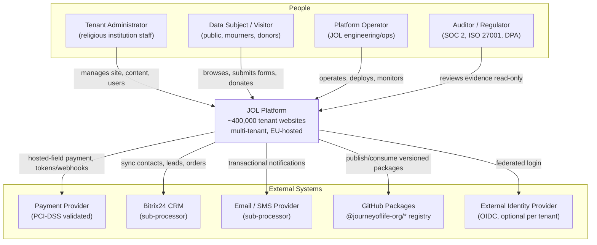

# System Landscape (C4 Level 1 — Context)

## Document Control

| Field            | Value                              |
|------------------|------------------------------------|
| Document ID      | ARC-L1-001                         |
| Title            | System Landscape (C4 Level 1)      |
| Version          | 1.0.0                              |
| Classification   | Public                             |
| Owner (role)     | Platform Architect                 |
| Approver (role)  | JOL Governance Board               |
| Effective Date   | 2026-09-25                         |
| Next Review      | 2027-09-25                         |
| Review Cycle     | Annual, or upon material change    |

## Purpose

This is the **C4 Level 1 (System Context)** view: who uses the Journey of Life (JOL) platform, what
the platform does, and which external systems it depends on. It deliberately hides internal detail
— see [`container-diagram.md`](container-diagram.md) for the next level in.

## Scope

The JOL platform is a white-label, multi-tenant website publishing system serving approximately
**400,000 religious-institution websites across 27 EU member states**, covering verticals such as
parish, diocese, funeral, cemetery-care, and memorial services.

## Context Diagram

## People (Actors)

| Actor | Description | Data relationship (GDPR) |
|-------|-------------|--------------------------|
| **Tenant Administrator** | Staff of a religious institution who manage their own website, content, and users. | Controller of their institution's data; JOL is processor. |
| **Data Subject / Visitor** | Members of the public who browse sites, submit forms (e.g. funeral notices), or donate. | Data subject; personal data processed on behalf of the tenant. |
| **Platform Operator** | JOL engineering/operations running and securing the platform. | Accesses personal data only under instruction and least privilege. |
| **Auditor / Regulator** | SOC 2 / ISO 27001 auditors and EU data-protection authorities. | Read-only access to evidence, not to production personal data. |

## External Systems

| System | Purpose | Trust boundary / notes |
|--------|---------|------------------------|
| **Payment Provider** | Card acceptance via hosted fields/redirect. | PCI-DSS validated third party; JOL stays out of the card-data path ([ADR-010](../adr/ADR-010-ecommerce-pci-saq-a.md)). Sub-processor. |
| **Bitrix24 CRM** | Contacts, organizations, leads, orders, automation. | Integrated via `jol-bitrix24-integration` and the `bitrix24` MCP server. Sub-processor. |
| **Email / SMS Provider** | Transactional notifications. | Sub-processor; personal data minimised in messages. |
| **GitHub Packages** | Private npm registry for `@journeyoflife-org/*`. | Build-time dependency of the hub/spokes ([ADR-011](../adr/ADR-011-hub-and-spoke-monorepo-federation.md)); no production personal data. |
| **External Identity Provider** | Optional OIDC federated login per tenant. | Handled by `jol-auth`; tenant-scoped. |

> **AI inference is not an external system.** LLM inference is self-hosted and air-gapped inside the
> JOL boundary ([ADR-008](../adr/ADR-008-self-hosted-llm-air-gapped.md)); it appears in the
> container diagram, not here.

## Hosting Boundary

The platform and its AI tier run on **JOL-owned Proxmox infrastructure inside the EU**. Primary
personal data is stored in self-hosted PostgreSQL ([ADR-005](../adr/ADR-005-postgresql-primary-datastore.md)).
Third-party sub-processors (payment, CRM, email) are recorded in
[`../gdpr/ropa-processor.md`](../gdpr/ropa-processor.md) and
[`../gdpr/international-transfers.md`](../gdpr/international-transfers.md).

## Compliance Anchors

| Framework | Relevance of this view |
|-----------|------------------------|
| GDPR Art. 30 | Identifies controllers, processors, sub-processors, and data subjects for the RoPA. |
| GDPR Art. 44–49 | Identifies which external systems may transfer data outside the EU. |
| SOC 2 CC6 | Establishes the trust boundary between people, the platform, and external systems. |
| ISO 27001 A.5/A.8 | Defines external dependencies for the ISMS scope. |

## Change History

| Version | Date | Author (role) | Change |
|---------|------|---------------|--------|
| 1.0.0 | 2026-09-25 | Platform Architect | Initial C4 Level-1 context view. |
