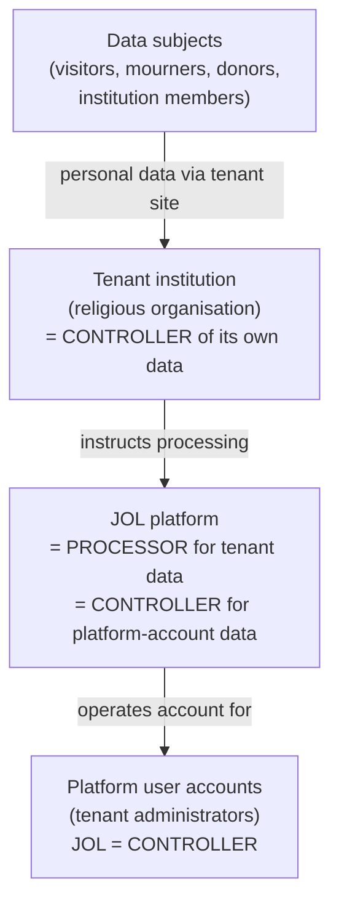

# GDPR — Records of Processing & Data-Flow Maps

## Document Control

| Field            | Value                              |
|------------------|------------------------------------|
| Document ID      | GDPR-IDX-001                       |
| Title            | GDPR Documentation Index           |
| Version          | 1.0.0                              |
| Classification   | Public                             |
| Owner (role)     | Data Protection Officer            |
| Approver (role)  | JOL Governance Board               |
| Effective Date   | 2026-09-25                         |
| Next Review      | 2027-09-25                         |
| Review Cycle     | Annual, or upon material change    |

This directory holds the platform's **GDPR Article 30 records of processing (RoPA)**, the supporting
data inventory, lawful-basis register, data-flow maps, retention schedule, and international-transfer
register. Together they document **what personal data the platform processes, why, on whose behalf,
for how long, and where it goes**.

> **Public-repo safety.** These records describe **categories** of personal data and **classes** of
> data subject. They must never contain real individuals' data, real tenant identifiers, credentials,
> or internal hostnames. Operational privacy artefacts (DPIAs, data-subject-request logs, breach
> records) live in [`jol-privacy`](https://github.com/journeyoflife-org/jol-privacy) and are linked,
> not duplicated.

## Controller vs Processor — the Critical Distinction

JOL operates in **two capacities**, and the records are split accordingly:

| Capacity | When | Record |
|----------|------|--------|
| **Processor** (Art. 30(2)) | JOL processes personal data **on behalf of** a tenant institution (the controller) — the overwhelming majority of platform data. | [`ropa-processor.md`](ropa-processor.md) |
| **Controller** (Art. 30(1)) | JOL determines purposes/means for **its own** processing — platform user accounts (tenant administrators), billing, security logging, and JOL's direct relationships. | [`ropa-controller.md`](ropa-controller.md) |

## Special-Category Data (Art. 9) — High-Risk by Domain

The platform serves **religious institutions** and processes content such as parish membership,
funeral notices, memorial records, and donations to religious organisations. This can reveal
**religious belief**, which is **special-category personal data under GDPR Art. 9**, and funeral/
cemetery records may concern **deceased individuals and their families**.

Consequences enforced across this documentation set:

- Special-category processing requires an **Art. 9(2) condition** (typically explicit consent, or
  the substantial-public-interest / not-for-profit-body conditions where applicable) — recorded per
  activity in [`lawful-basis-register.md`](lawful-basis-register.md).
- **Data minimisation** and **purpose limitation** are strictly applied; special-category fields are
  avoided unless necessary.
- A **DPIA** (Art. 35) is mandatory for these activities — maintained in `jol-privacy`.
- Encryption at rest and in transit, strict RLS tenant isolation
  ([ADR-007](../adr/ADR-007-multi-tenant-rls-isolation.md)), and least-privilege access.

## Documents in This Directory

| Document | GDPR basis | Purpose |
|----------|-----------|---------|
| [`ropa-controller.md`](ropa-controller.md) | Art. 30(1) | Record of processing where JOL is controller |
| [`ropa-processor.md`](ropa-processor.md) | Art. 30(2) | Record of processing where JOL is processor for tenants |
| [`data-inventory.md`](data-inventory.md) | Art. 30(1)(d) | Categories of personal data and data subjects, with sources |
| [`lawful-basis-register.md`](lawful-basis-register.md) | Art. 6, Art. 9 | Lawful basis per processing activity |
| [`data-flow-maps.md`](data-flow-maps.md) | Art. 30(1)(e) | Per-activity data-flow diagrams (ingress → store → recipients) |
| [`retention-schedule.md`](retention-schedule.md) | Art. 5(1)(e) | Retention periods, erasure, and storage limitation |
| [`international-transfers.md`](international-transfers.md) | Art. 44–49 | Third-country transfers, SCCs, and sub-processors |

## Data-Subject Rights (Art. 12–22)

Rights requests (access, rectification, erasure, restriction, portability, objection) are handled
operationally in [`jol-privacy`](https://github.com/journeyoflife-org/jol-privacy). Key platform
facts that enable them:

- **Erasure** is supported by design: `UserProfile` is kept separate from the auth `User` record so
  profile data can be erased without breaking authentication integrity; `User` uses **soft delete**
  (`is_deleted`, `deleted_at`) followed by scheduled hard purge.
- **Portability**: tenant and user data can be exported per tenant under RLS isolation.
- **Consent**: `gdpr_consent`, `gdpr_consent_at`, `marketing_consent`, `marketing_consent_at` are
  stored on the user record with timestamps for auditability.

## Relationship to Other Repositories

| Repository | Relationship |
|------------|--------------|
| [`jol-privacy`](https://github.com/journeyoflife-org/jol-privacy) | DPIAs, DSR handling, breach records — operational privacy artefacts |
| [`jol-policies`](https://github.com/journeyoflife-org/jol-policies) | Data Classification & Handling Policy, ISMS policies |
| [`jol-compliance-evidence`](https://github.com/journeyoflife-org/jol-compliance-evidence) | Evidence that these records are implemented and monitored |
| [`jol-control`](https://github.com/journeyoflife-org/jol-control) | Enforces repo-level controls (secret scanning, branch protection) |

## Change History

| Version | Date | Author (role) | Change |
|---------|------|---------------|--------|
| 1.0.0 | 2026-09-25 | Data Protection Officer | Initial GDPR documentation set (Art. 30 RoPA, inventory, lawful basis, data-flow maps, retention, transfers). |
