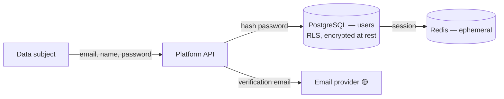
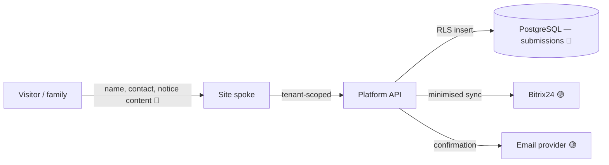
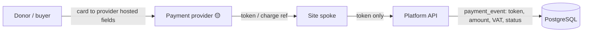
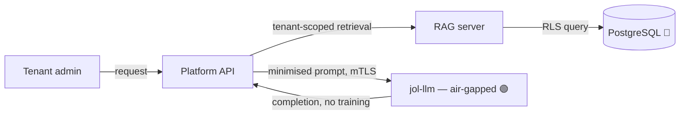
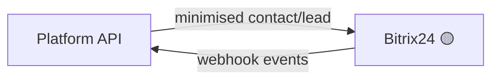

# GDPR Data-Flow Maps

## Document Control

| Field            | Value                              |
|------------------|------------------------------------|
| Document ID      | GDPR-DFM-001                       |
| Title            | GDPR Data-Flow Maps                |
| Version          | 1.0.0                              |
| Classification   | Public                             |
| Owner (role)     | Data Protection Officer            |
| Approver (role)  | JOL Governance Board               |
| Effective Date   | 2026-09-25                         |
| Next Review      | 2027-09-25                         |
| Review Cycle     | Annual, or upon material change    |

## Purpose

These maps trace **personal data** through each processing activity: where it enters, where it is
stored, who receives it, and whether it leaves the EU. They satisfy the Art. 30(1)(e)/30(2)(c)
"recipients" and "transfers" elements and feed DPIAs. The system-level (non-GDPR) view is
[`../architecture/data-flow.md`](../architecture/data-flow.md).

**Legend:** 🟢 EU-only · 🟡 may transfer to sub-processor (SCCs) · 🔴 special-category (Art. 9).

## Map 1 — Account Registration (controller, C1) 🟢

| Element | Value |
|---------|-------|
| Data | email, name, password hash, role |
| Basis | Art. 6(1)(b) contract |
| Store | PostgreSQL (EU, RLS, encrypted) |
| Recipients | Email provider (verification) 🟡 |
| Transfer | Email provider — see [`international-transfers.md`](international-transfers.md) |
| Retention | Account life + purge ([`retention-schedule.md`](retention-schedule.md)) |

## Map 2 — Public Form / Funeral Notice (processor, P2) 🔴

| Element | Value |
|---------|-------|
| Data | submitter identity, contact, notice content — **may reveal religious belief** 🔴 |
| Capacity | JOL = **processor**; tenant = **controller** |
| Basis (controller) | Art. 6(1)(a)/(b); Art. 9(2)(a) explicit consent or 9(2)(d) |
| Store | PostgreSQL (EU, RLS, encrypted) |
| Recipients | Tenant controller; Bitrix24 🟡; Email 🟡 |
| Minimisation | Only fields necessary for the notice; no special-category fields unless required |
| Retention | Per tenant instruction + platform default ([`retention-schedule.md`](retention-schedule.md)) |

## Map 3 — Donation / Payment (processor, P3) 🟡

| Element | Value |
|---------|-------|
| Data | payment token/reference, amount, VAT, status — **no PAN/card data** ([ADR-010](../adr/ADR-010-ecommerce-pci-saq-a.md)) |
| Basis (controller) | Art. 6(1)(b) contract |
| Store | PostgreSQL (`payment_events`, `financial`) |
| Recipients | Payment provider 🟡 (controller for its PCI scope) |
| Transfer | Payment provider — see [`international-transfers.md`](international-transfers.md) |
| Retention | Statutory financial retention ([`retention-schedule.md`](retention-schedule.md)) |

## Map 4 — AI Content Generation (processor, P5) 🟢🔴

| Element | Value |
|---------|-------|
| Data | tenant-scoped context (may include belief data 🔴), minimised prompt |
| Basis (controller) | Art. 6(1)(f); Art. 9 condition if belief data used |
| Store | Transient prompt/completion; tenant content in PostgreSQL |
| Recipients | **None external** — self-hosted, air-gapped ([ADR-008](../adr/ADR-008-self-hosted-llm-air-gapped.md)) |
| Transfer | 🟢 EU-only; no third-party LLM API |
| Guarantee | Tenant content **never** trains shared models; no cross-tenant retrieval |

## Map 5 — CRM Synchronisation (processor, P4) 🟡

| Element | Value |
|---------|-------|
| Data | contact identity, lead/order data — tenant-scoped, minimised |
| Recipient | Bitrix24 (sub-processor) 🟡 |
| Transfer | Per [`international-transfers.md`](international-transfers.md) |
| Control | On tenant instruction; DPA in place |

## Cross-Map Transfer Summary

| Recipient | Maps | EU? | Safeguard |
|-----------|------|-----|-----------|
| Email/SMS provider | 1, 2 | Varies | DPA + SCCs/adequacy |
| Bitrix24 CRM | 2, 5 | Varies | DPA + SCCs/adequacy |
| Payment provider | 3 | Varies | PCI-DSS + DPA |
| Self-hosted AI | 4 | 🟢 EU | n/a (internal, air-gapped) |

See [`international-transfers.md`](international-transfers.md) for the authoritative transfer register.

## Change History

| Version | Date | Author (role) | Change |
|---------|------|---------------|--------|
| 1.0.0 | 2026-09-25 | Data Protection Officer | Initial per-activity GDPR data-flow maps. |
