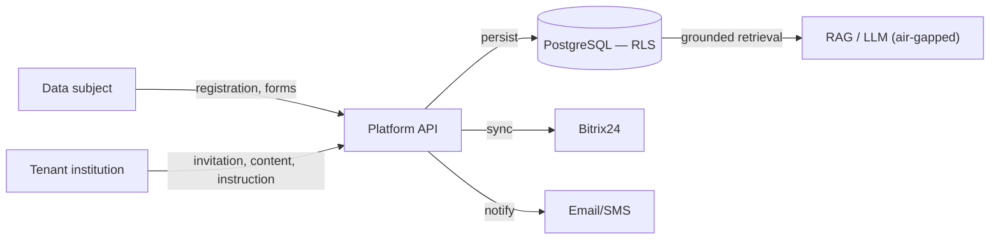

# Personal-Data Inventory

## Document Control

| Field            | Value                              |
|------------------|------------------------------------|
| Document ID      | GDPR-DI-001                        |
| Title            | Personal-Data Inventory            |
| Version          | 1.0.0                              |
| Classification   | Public                             |
| Owner (role)     | Data Protection Officer            |
| Approver (role)  | JOL Governance Board               |
| Effective Date   | 2026-09-25                         |
| Next Review      | 2027-09-25                         |
| Review Cycle     | Annual, or upon material change    |

## Purpose

This inventory enumerates the **categories and fields** of personal data the platform processes,
their source, classification, and special-category status. It is the field-level basis for the
records of processing ([`ropa-controller.md`](ropa-controller.md),
[`ropa-processor.md`](ropa-processor.md)) and is derived from the platform data model (the
`users` app and related tenant/content/commerce apps).

> **Synthetic only.** Field names and categories are documented; **no real values** appear here.

## Platform User Account (`users` model)

| Field | Category | Special category (Art. 9)? | Sensitivity | Source | Notes |
|-------|----------|----------------------------|-------------|--------|-------|
| `email` | Identity / contact | No | High (identifier) | Data subject | Unique, indexed; primary login identifier |
| `first_name`, `last_name` | Identity | No | Medium | Data subject | Optional (blank allowed) |
| `password` (hash) | Authentication | No | **Critical** | Data subject | Hashed; never plaintext |
| `mfa_enabled`, `mfa_secret` | Authentication | No | **Critical** | Data subject | MFA secret is a credential — encrypt at rest |
| `role` | Authorisation | No | Medium | Tenant/JOL | admin / editor / viewer / member |
| `is_staff`, `is_active`, `is_verified` | Account state | No | Low | System | Lifecycle & verification flags |
| `is_deleted`, `deleted_at` | Lifecycle | No | Low | System | Soft delete → scheduled hard purge |
| `phone` | Contact | No | Medium | Data subject | Optional |
| `avatar` | Profile (image) | No | Medium | Data subject | Object storage, tenant-scoped path |
| `date_of_birth` (profile) | Identity | No | **High** | Data subject | Kept in separate `UserProfile` for erasure |
| `preferred_language`, `timezone`, `country` | Preferences | No | Low | Data subject | `country` is a 2-letter code, not precise location |
| `bio`, `website` (profile) | Profile | No | Low | Data subject | Separate `UserProfile` |
| `notification_preferences`, `extra` (profile) | Preferences | No | Low | Data subject | JSON; minimised |
| `gdpr_consent`, `gdpr_consent_at` | Consent record | No | Medium | Data subject | Proof of consent (Art. 7(1)) |
| `marketing_consent`, `marketing_consent_at` | Consent record | No | Medium | Data subject | Separate marketing opt-in |
| `last_login_ip` | Usage / technical | No | Medium | System | IP is personal data; minimise retention |
| `login_count`, `last_login` | Usage | No | Low | System | Security & analytics |

**Design note (privacy by design, Art. 25):** `UserProfile` (bio, website, date of birth,
preferences) is deliberately **separate** from the auth-bearing `User` record so profile data can be
**erased without breaking authentication integrity**. `User` uses **soft delete** so erasure is
reversible only within a short window, then hard-purged.

## Tenant / Organization Data (processor role)

| Category | Special category? | Notes |
|----------|-------------------|-------|
| Tenant institution identity (name, address, VAT/tax ID) | No | The controller's own business data |
| Tenant staff accounts & memberships | No | Managed on tenant instruction |
| Tenant content (pages, notices, memorial/funeral entries) | **Possibly yes** | May reveal religious belief; may concern deceased & families |
| Public visitor submissions (forms, contact, service requests) | **Possibly yes** | Captured on behalf of the tenant controller |
| Donations / orders (amounts, references, tokens) | Possibly | No card data ([ADR-010](../adr/ADR-010-ecommerce-pci-saq-a.md)) |
| CRM contacts / leads (Bitrix24 sync) | Possibly | Tenant-scoped |
| Per-tenant analytics events | No | Minimised, aggregated where possible |

## Special-Category Data (Art. 9) Summary

| Art. 9 category | Where it may arise | Capacity | Condition source |
|-----------------|--------------------|----------|------------------|
| **Religious belief** | Tenant content, funeral/memorial notices, parish records, donations to religious bodies | JOL = **processor** | Determined by tenant **controller** (e.g. Art. 9(2)(a) explicit consent, (d) not-for-profit body, (g) substantial public interest) |
| **Data of deceased / families** | Funeral, cemetery-care, memorial verticals | JOL = **processor** | Living relatives' data is in scope; tenant DPIA required |

JOL-as-controller activities (platform accounts, billing, security) do **not** intentionally collect
Art. 9 data; the user model has **no** religious-belief field.

## Data Classification Cross-Reference

| Classification | Examples | Handling |
|----------------|----------|----------|
| **Critical / credential** | password hash, MFA secret, tokens | Encrypt at rest, never log, strict access |
| **High** | email, date of birth, IP, special-category content | Encrypt, minimise, RLS-isolated |
| **Medium** | name, phone, role, consent records | Access-controlled, tenant-scoped |
| **Low** | preferences, counts, lifecycle flags | Standard controls |

Classification handling rules are defined in the
[JOL Data Classification & Handling Policy](https://github.com/journeyoflife-org/jol-policies/blob/main/policies/data-classification-and-handling.md).

## Sources & Lineage

## Change History

| Version | Date | Author (role) | Change |
|---------|------|---------------|--------|
| 1.0.0 | 2026-09-25 | Data Protection Officer | Initial personal-data inventory derived from the platform data model. |
