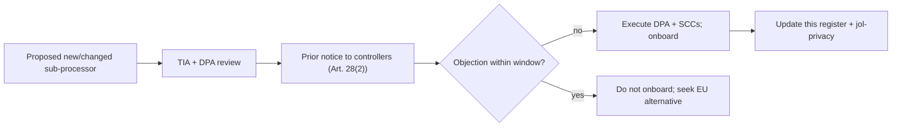

# International Transfers Register (GDPR Art. 44–49)

## Document Control

| Field            | Value                              |
|------------------|------------------------------------|
| Document ID      | GDPR-IT-001                        |
| Title            | International Transfers Register   |
| Version          | 1.0.0                              |
| Classification   | Public                             |
| Owner (role)     | Data Protection Officer            |
| Approver (role)  | JOL Governance Board               |
| Effective Date   | 2026-09-25                         |
| Next Review      | 2027-09-25                         |
| Review Cycle     | Annual, or upon material change    |

## Purpose

Any transfer of personal data outside the EU/EEA must have a lawful transfer mechanism (Art. 44–49).
This register lists the categories of transfers, the sub-processors involved, the destination, and
the safeguard relied upon. It supports the Art. 30 "transfers" element and post-*Schrems II*
transfer-impact assessments (TIAs).

> **Default position:** primary personal data is stored in **self-hosted EU** infrastructure
> (PostgreSQL on Proxmox, [ADR-005](../adr/ADR-005-postgresql-primary-datastore.md)), and AI
> inference is **air-gapped in the EU** ([ADR-008](../adr/ADR-008-self-hosted-llm-air-gapped.md)).
> Transfers occur only via documented sub-processors and only where necessary.

## Transfer Mechanisms (reference)

| Mechanism | Article | Use |
|-----------|---------|-----|
| **Adequacy decision** | Art. 45 | Transfers to countries deemed adequate by the European Commission |
| **Standard Contractual Clauses (SCCs)** | Art. 46(2)(c) | Default mechanism for sub-processors in non-adequate countries, with supplementary measures |
| **Derogations** | Art. 49 | Rare, specific situations only (not a basis for systematic transfers) |

## Transfer Register

| Recipient category | Function | Destination (typical) | Mechanism | Supplementary measures |
|--------------------|----------|-----------------------|-----------|------------------------|
| Email / SMS provider | Transactional & marketing notifications | EU preferred; may be US | SCCs (Art. 46) or adequacy | TLS, minimised payload, EU data-residency option where available |
| Bitrix24 (CRM) | Contact / lead / order sync | EU preferred; may be US/self-hosted | SCCs (Art. 46) or adequacy | Tenant-scoped, minimised fields, encryption |
| Payment provider | Card processing (hosted fields) | EU preferred; may be US | SCCs (Art. 46) or adequacy + PCI-DSS | No PAN to JOL; tokens only ([ADR-010](../adr/ADR-010-ecommerce-pci-saq-a.md)) |
| Object storage / CDN (if used) | Media delivery | EU region preferred | SCCs (Art. 46) or adequacy | EU region pinning, signed URLs |
| GitHub Packages | Build-time npm packages | US (build-time only) | **No production personal data** | Packages carry code, not personal data; out of scope for data-transfer |

> **Build-time vs runtime.** GitHub Packages hosts code packages (`@journeyoflife-org/*`), not
> personal data; it is not a personal-data transfer. It is listed for completeness and supply-chain
> transparency ([ADR-011](../adr/ADR-011-hub-and-spoke-monorepo-federation.md)).

## Transfer-Impact Assessment (TIA) — *Schrems II*

For each non-adequate transfer (notably any US sub-processor), a TIA is performed and recorded in
`jol-privacy`, assessing:

1. **The law and practice** of the destination country (government access regimes).
2. **The specific transfer** (data categories, volume, sensitivity — note special-category 🔴 data in
   [`ropa-processor.md`](ropa-processor.md)).
3. **Supplementary measures** (technical: encryption in transit/at rest, EU data-residency,
   minimisation; contractual: SCCs with audit and notification clauses; organisational: access
   controls).
4. **Residual risk** and whether the transfer can proceed.

Where a TIA cannot mitigate risk, the transfer is **not made** and an EU-only alternative is used.

## Processor Obligations on Transfers

As processor, JOL transfers personal data to a third country **only on documented controller
instruction** (Art. 28(3)(a)), including for transfers, unless EU law requires otherwise (in which
case JOL informs the controller before processing). JOL gives **prior notice** of new or changed
sub-processors (Art. 28(2)) and flows down equivalent data-protection obligations to
sub-processors (Art. 28(4)).

## Sub-Processor Change Management

## Compliance Anchors

| Framework | Relevance |
|-----------|-----------|
| GDPR Art. 44–49 | Lawful transfer mechanism per transfer |
| GDPR Art. 28(2)/(3)(a)/(4) | Processor transfer obligations, sub-processor flow-down |
| GDPR Art. 30(1)(e)/30(2)(c) | Transfer documentation in the RoPA |
| SOC 2 CC6 / ISO 27001 A.5 | Third-party / supplier security management |

## Change History

| Version | Date | Author (role) | Change |
|---------|------|---------------|--------|
| 1.0.0 | 2026-09-25 | Data Protection Officer | Initial international-transfers register and TIA framework. |
