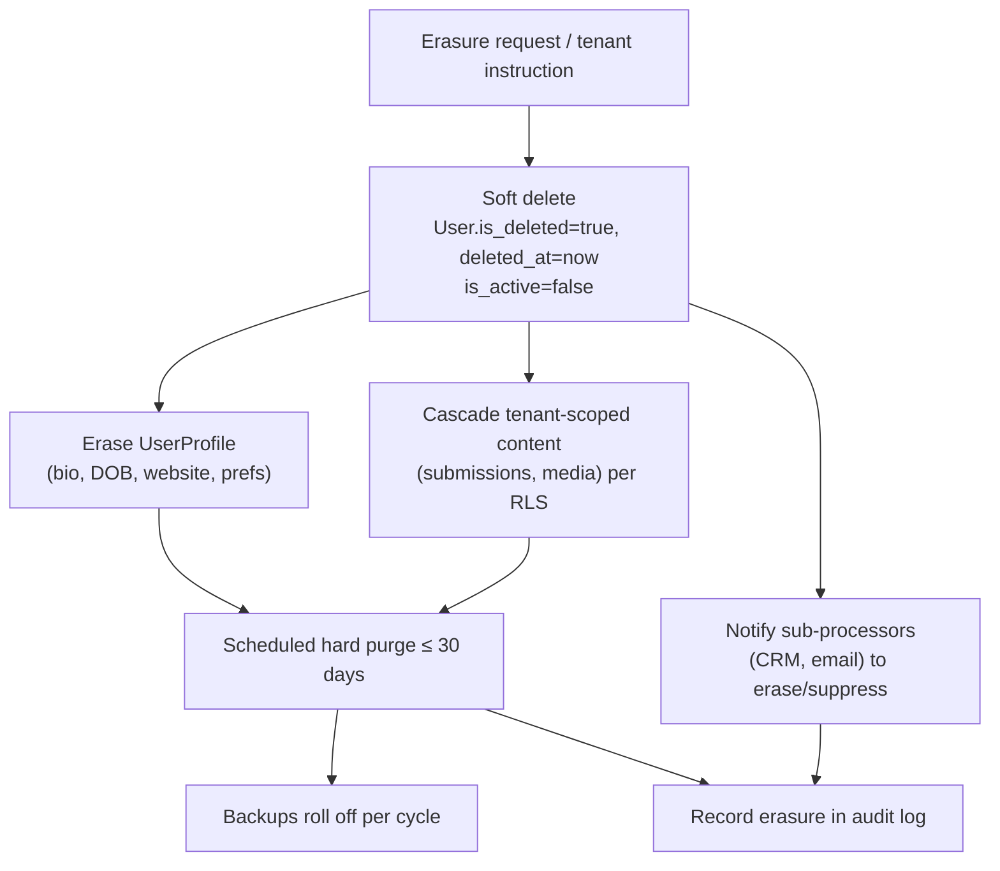

# Retention & Erasure Schedule

## Document Control

| Field            | Value                              |
|------------------|------------------------------------|
| Document ID      | GDPR-RS-001                        |
| Title            | Retention & Erasure Schedule       |
| Version          | 1.0.0                              |
| Classification   | Public                             |
| Owner (role)     | Data Protection Officer            |
| Approver (role)  | JOL Governance Board               |
| Effective Date   | 2026-09-25                         |
| Next Review      | 2027-09-25                         |
| Review Cycle     | Annual, or upon material change    |

## Purpose

GDPR Art. 5(1)(e) (storage limitation) requires that personal data be kept **no longer than
necessary**. This schedule defines retention periods and the erasure mechanism per data category.
Where JOL is a **processor**, retention follows the **tenant controller's instruction** (with a
platform default and a maximum); where JOL is **controller**, the periods below apply.

> Periods marked "statutory" depend on member-state law (27 EU countries); the per-country value is
> configured in `jol-hub/countries/*` and recorded in `jol-privacy`.

## Retention Periods

| Data category | Capacity | Retention | Trigger for erasure |
|---------------|----------|-----------|---------------------|
| Platform user account (active) | Controller | Duration of account + contract | Account closure / erasure request |
| Platform user account (closed) | Controller | Soft-delete immediately; **hard purge ≤ 30 days** | Scheduled purge job |
| `UserProfile` (bio, DOB, website, prefs) | Controller | Erased on request **without** deleting auth record | Erasure request (Art. 17) |
| Authentication credentials (password hash, MFA secret) | Controller | Life of account; purged on hard delete | Hard purge |
| Billing / invoices / financial records | Controller | **Statutory** (commonly up to 10 years for tax) | End of statutory period |
| Payment events / tokens | Processor | Statutory financial retention | End of statutory period |
| Security logs (login IP, auth events) | Controller | **≤ 12 months** (minimised); IP truncated where feasible | Rolling expiry |
| Operational logs / telemetry | Controller/Processor | **≤ 90 days** for personal-data-bearing logs | Rolling expiry |
| Consent records (`gdpr_consent_at`, `marketing_consent_at`) | Controller | Duration of consent **+ proof-of-withdrawal period** | Withdrawal + evidence window |
| Marketing lists | Controller | Until consent withdrawn | Withdrawal (Art. 7(3)) |
| Tenant website content | Processor | Per tenant instruction (platform default + max) | Tenant instruction / contract end |
| Public form / funeral-notice submissions 🔴 | Processor | Per tenant instruction; **platform maximum** applies | Tenant instruction / maximum |
| CRM contacts / leads | Processor | Per tenant instruction; synced-deletion on request | Tenant instruction / erasure |
| AI prompts / completions (transient) | Processor | **Short-lived** (≤ 30 days) for observability; no training retention | Rolling expiry |
| Backups | Controller/Processor | Rolloff per backup policy (`jol-dr`); erasure honoured at restore | Backup cycle expiry |

## Erasure Mechanism (Art. 17)

**Design features that make erasure possible:**

- **Soft delete** on `User` (`is_deleted`, `deleted_at`) gives a short reversible window, then a
  scheduled **hard purge**.
- **`UserProfile` separation** allows erasing profile data (including date of birth) while retaining
  the minimal auth record needed for integrity and audit.
- **RLS tenant scoping** ensures erasure cascades only within the correct tenant
  ([ADR-007](../adr/ADR-007-multi-tenant-rls-isolation.md)).
- **Sub-processor propagation**: erasure is forwarded to CRM/email sub-processors (Art. 28(3)(e)).
- **Backups**: erasure is honoured on restore and as backup media roll off; backups are not
  selectively edited.

## Exceptions to Erasure (Art. 17(3))

Erasure may be refused/limited where processing is necessary for: exercising freedom of expression;
compliance with a **legal obligation** (e.g. statutory financial retention); **legal claims**; or
public-interest/archival purposes. Refusals are recorded with the basis in `jol-privacy`.

## Review & Monitoring

- Retention jobs and their success are monitored and evidenced in `jol-compliance-evidence`.
- This schedule is reviewed **annually** and upon material change (new data category, new
  sub-processor, regulatory change).

## Change History

| Version | Date | Author (role) | Change |
|---------|------|---------------|--------|
| 1.0.0 | 2026-09-25 | Data Protection Officer | Initial retention & erasure schedule. |
